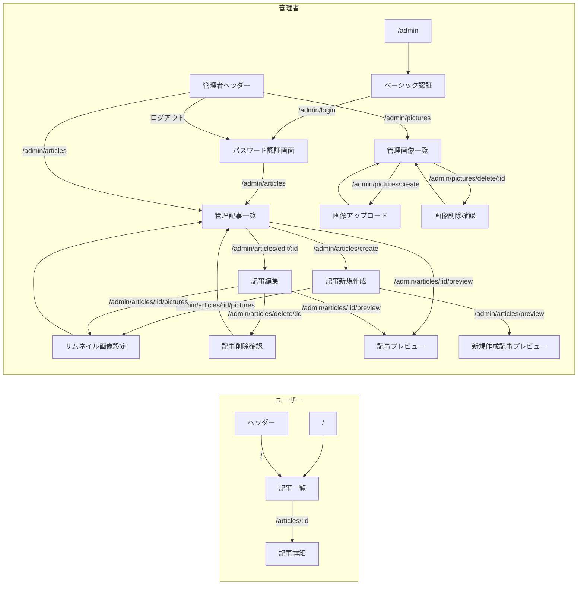
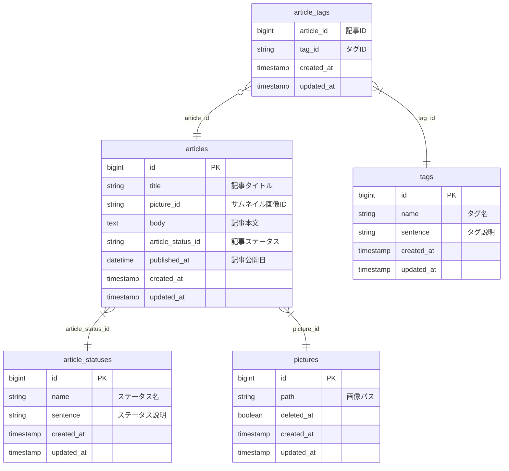

# simple-cms
Laravel10xとDDD(ドメイン駆動設計)学習用のシンプルなCMS  
(WordPressの完全下位互換)  

# 設計/仕様
## 機能一覧
- ユーザー 
    - 記事一覧表示
        - 新着順で表示
        - リスト表示内容
            - サムネイル画像表示
            - タイトル表示
            - タグ表示
    - 記事詳細表示
        - サムネイル画像表示
        - タイトル表示
        - タグ表示
        - 本文表示
            - MarkDown解析表示
            - 画像埋め込みコード解析
- 管理者
    - ベーシック認証
    - ログイン
    - ログアウト
    - 管理記事一覧
        - 記事ジャンプ
        - 記事新規作成
            - サムネイル画像設定
            - タイトル作成
            - タグ設定
            - 本文作成
                - MarkDownで登録
                - 画像埋め込みコード登録
            - プレビュー
            - 下書き保存
        - 記事編集
            - サムネイル画像設定
            - タイトル作成
            - タグ設定
            - 本文作成
                - MarkDownで登録
                - 画像埋め込みコード登録
            - プレビュー
                - MarkDown解析表示
                - 画像埋め込みコード解析
            - 記事の非公開
            - 記事の削除
    - 管理画像一覧
        - 画像埋め込みコード発行
        - 画像アップロード
        - 画像の削除

## WBS(タスクリスト)
./WBS.mdをご参照ください。  

## 画面遷移図

## ER図

## アーキテクチャ
DDD x なんちゃってクリーンアーキテクチャ  
なんちゃってクリーンアーキテクチャ: [5年間 Laravel を使って辿り着いた，全然頑張らない「なんちゃってクリーンアーキテクチャ」という落としどころ](https://zenn.dev/mpyw/articles/ce7d09eb6d8117)  

## コーディングルール
- Controller、UseCases、Services配下のクラスでは`declare(strict_types = 1);`を使用する。  

### UseCaseについて
- UseCase配下にはビジネスロジックをガッツリ記述する。
- Eloquentをガンガン使用してOK。
- テストは機能テストで担保する。

### Entityについて
- 同じテーブルであったとしても、ドメインごとにEntityを分割する。
    - (例) articlesテーブルはユーザー用と管理者用で、それぞれ別クラスのEntityを作成する。  
- Entityには`JsonSerializable`を継承させてあげる。
    - APIモードへの移行が容易になる。

### Serviceクラスについて
- Serviceクラスには共通で使用するロジック等を記述する。
- 永続化データを扱わない純粋なロジックを記述する。
- 基本的にServiceクラス内ではEloquentの使用は禁止(ただし、引数の型としてModelsのクラスの受け取りはOK)。
- PHPUnitでテストコードを記述すること。

# 開発環境構築
1. コンテナを立ち上げる  
`docker-compose up -d`
2. ライブラリインストール  
`docker exec -it simple_cms_app composer install`
3. データベースを作成  
`docker exec -it simple_cms_db mysql -uroot -ppass -e "create database simple_cms;"`
4. テーブルを作成  
`docker exec -it simple_cms_app php artisan migrate`
5. 開発用データ投入  
`docker exec -it simple_cms_app php artisan db:seed --class=DevlopSeeder`
6. リンクを作成  
`docker exec -it simple_cms_app php artisan storage:link`
7. トップページにアクセス  
http://localhost:8080  

# テスト
## コード静的解析実行(Larastan)
`docker exec -it simple_cms_app ./vendor/bin/phpstan analyse --memory-limit=1G`

## テスト実行
1. データベースをクリア  
`docker exec -it simple_cms_app php artisan migrate:fresh`
2. PHPUnit実行  
`docker exec -it simple_cms_app php artisan test`

## コードのカバレッジ率を測定
1. Xdebugのコンテナを起動  
`docker-compose -f ./docker-compose.xdebug.yml up -d`
2. php.iniのxdebugの設定を変更  
`docker exec -it simple_cms_app sed -i 's/xdebug.mode=debug/xdebug.mode=coverage/g' /etc/php81/php.ini`
3. PHPUnitを実行  
`docker exec -it simple_cms_app php artisan test --coverage`