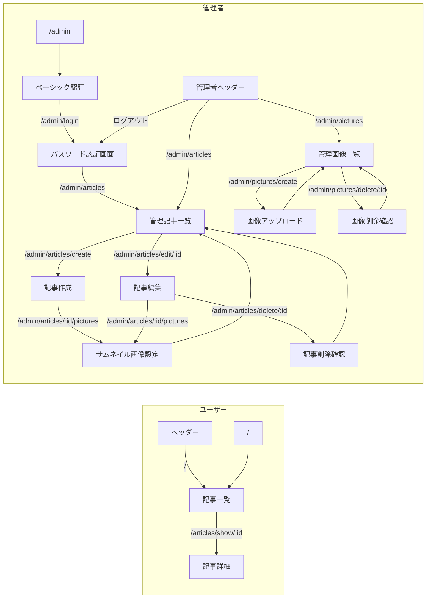
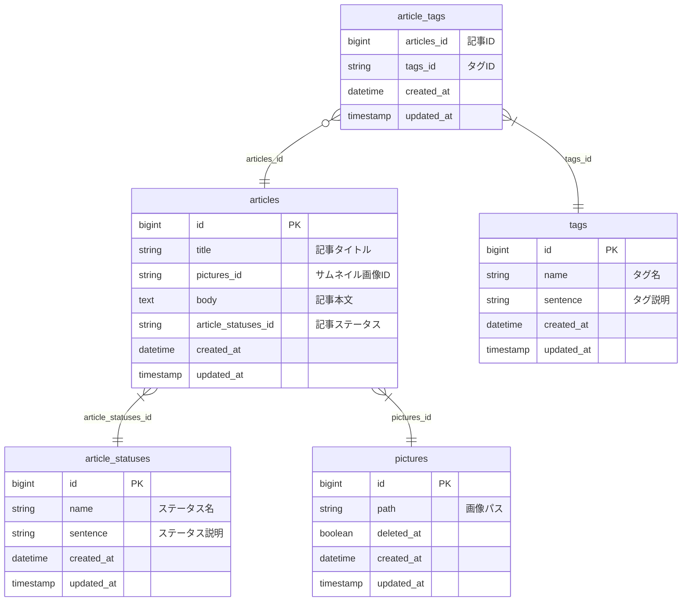

# simple-cms
Laravel10x学習用のシンプルなCMS

# 仕様
## 機能一覧
- ユーザー 
    - 記事一覧表示
        - 新着順で表示
        - リスト表示内容
            - サムネイル画像表示
            - タイトル表示
            - タグ表示
    - 記事詳細表示
        - サムネイル画像表示
        - タイトル表示
        - タグ表示
        - 本文表示
            - MarkDown解析表示
- 管理者
    - ベーシック認証
    - ログイン
    - ログアウト
    - 管理記事一覧
        - 記事ジャンプ
        - 記事作成
            - サムネイル画像設定
            - タイトル作成
            - タグ設定
            - 本文作成
                - MarkDownで登録
            - プレビュー
            - 下書き保存
        - 記事編集
            - サムネイル画像設定
            - タイトル作成
            - タグ設定
            - 本文作成
                - 画像埋め込みコード変換
            - プレビュー
            - 記事の非公開
            - 記事の削除
    - 管理画像一覧
        - 画像埋め込みコード発行
        - 画像アップロード
        - 画像の削除

## 画面遷移図

## ER図

# 開発環境構築
## コンテナを立ち上げる
    docker-compose up -d

## ライブラリインストール
    docker exec -it simple_cms_app composer install

## データベースを作成
    docker exec -it simple_cms_db mysql -uroot -ppass -e "create database simple_cms;"

## テーブルを作成
    docker exec -it simple_cms_app php artisan migrate

## 開発用データ投入
    docker exec -it simple_cms_app php artisan db:seed --class=DevSeeder

## リンクを作成
    docker exec -it simple_cms_app php artisan storage:link

http://localhost:8080  

# テスト実行手順
